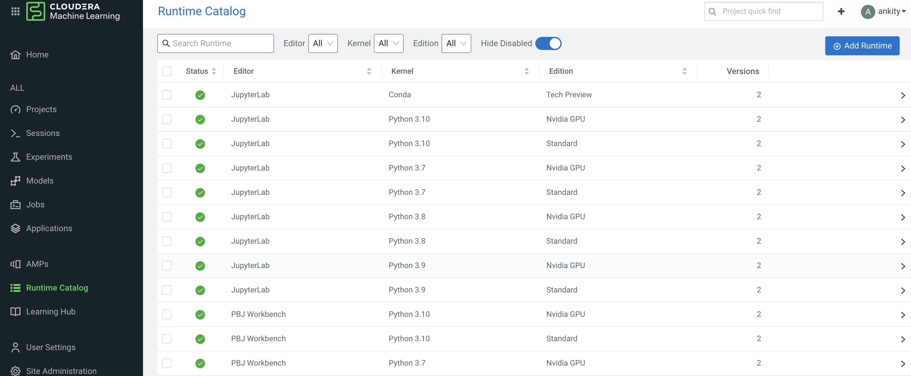
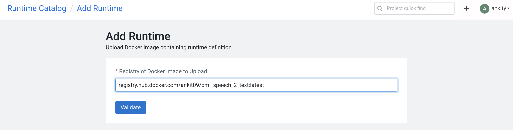
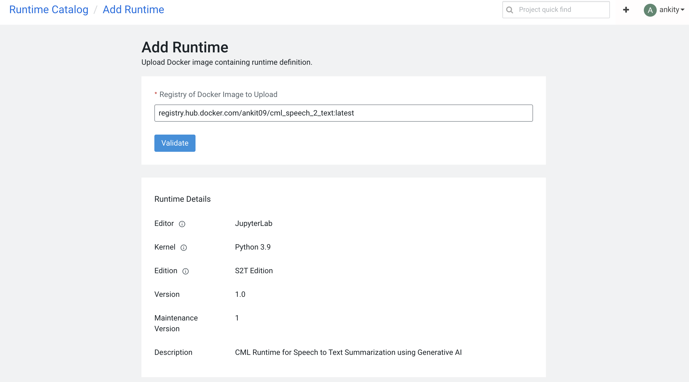
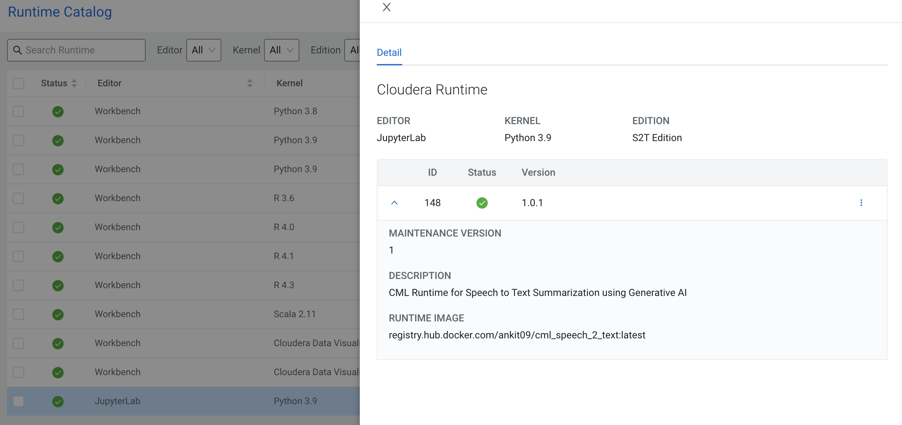

# Add CML Runtime with required packages for Speech to Text

OpenAI Whisper requires the **ffmpeg** package to be installed for Speech to Text processing. This document walks through the steps to add a CML runtime with the required package to your workspace. Once added, the Runtime can be used to create projects on top the Whisper model.

## Navigate to the Runtime Catalog of your CML Workspace



## Click on Add Runtime and add the following Docker Image for Speech To Text
```
registry.hub.docker.com/ankit09/cml_speech_2_text:latest
```



## Validate the Runtime 



## Verify the Runtime in CML




Click on Add to Catalog

